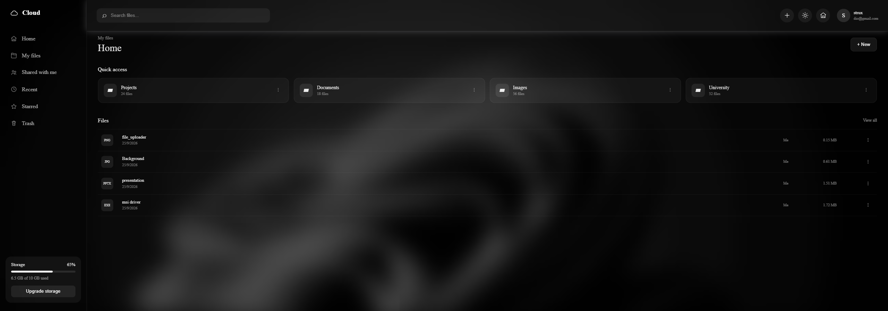
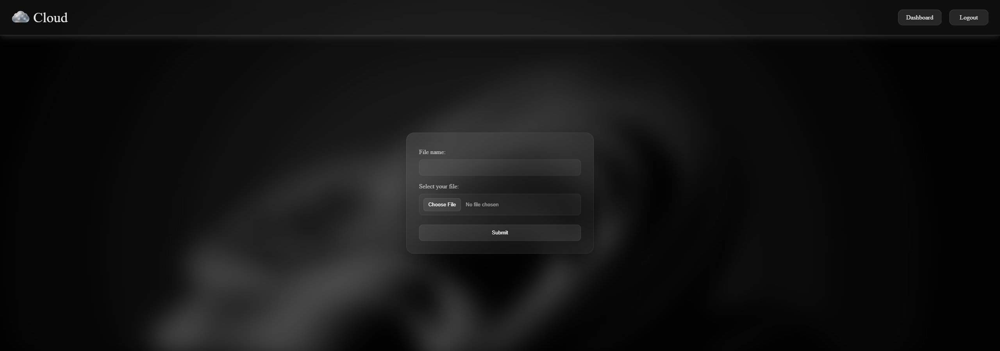
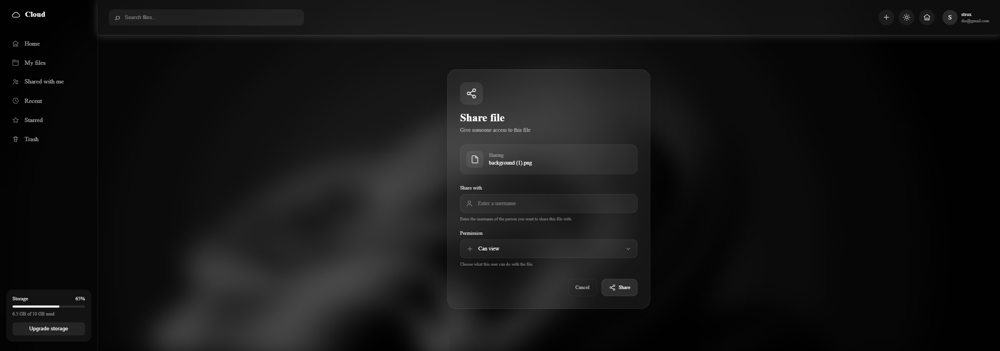

# File Uploader

A web application for uploading, managing, and sharing files.

This project provides authenticated file management with persistent storage and user-based access control.
## Screenshots

### Dashboard



### File Upload



### File Sharing



## Features

* User authentication
* Protected routes
* File uploads
* File management
* File sharing
* User dashboard
* PostgreSQL database
* Cloud file storage

## Tech Stack

* Node.js
* Express
* EJS
* PostgreSQL
* Prisma
* Supabase
* Multer
* bcrypt
* express-session

## Getting Started

### Requirements

* Node.js
* PostgreSQL / Supabase
* Supabase Storage

### Installation

```bash
git clone https://github.com/Sttrux/File_Uploader.git
cd File_Uploader
npm install
```

Create a `.env` file with your database, session, and Supabase credentials.

```env
DATABASE_URL="your_database_url"
SESSION_SECRET="your_session_secret"
SUPABASE_URL="your_supabase_url"
SUPABASE_KEY="your_supabase_key"
```

### Database

The database schema is located in the `db` directory.

After configuring the database connection, pull the current database structure into Prisma:

```bash
npx prisma db pull
```

Then generate the Prisma Client:

```bash
npx prisma generate
```

### Run

Start the application:

```bash
npm run dev
```

## Status

Beta — actively under development.

## Author

[Sttrux](https://github.com/Sttrux)
